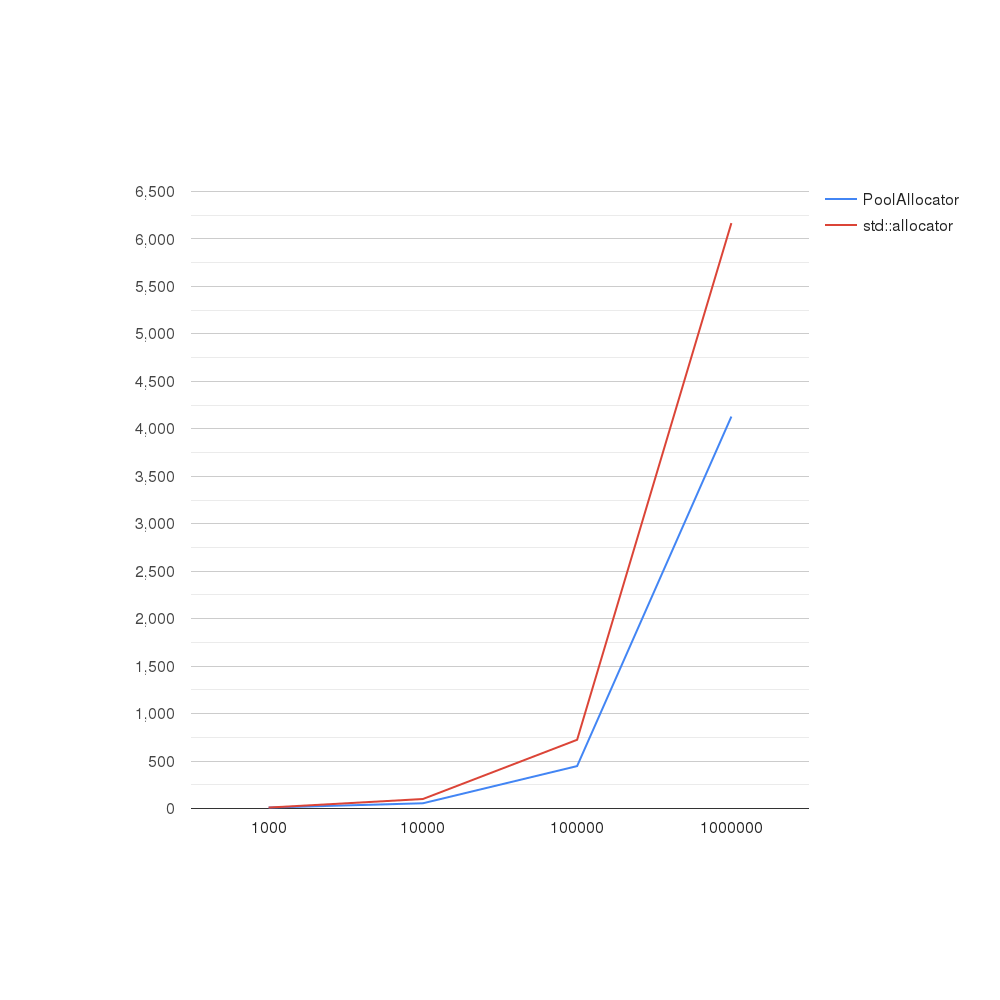
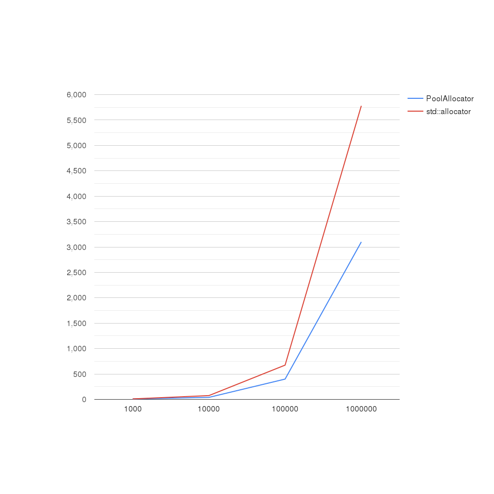
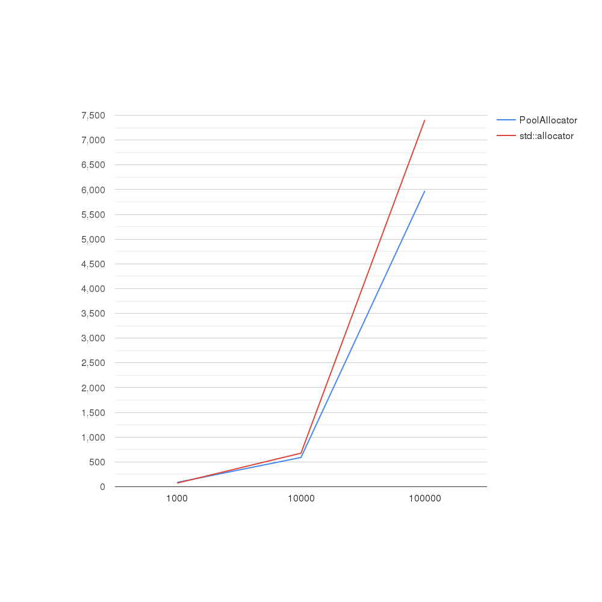
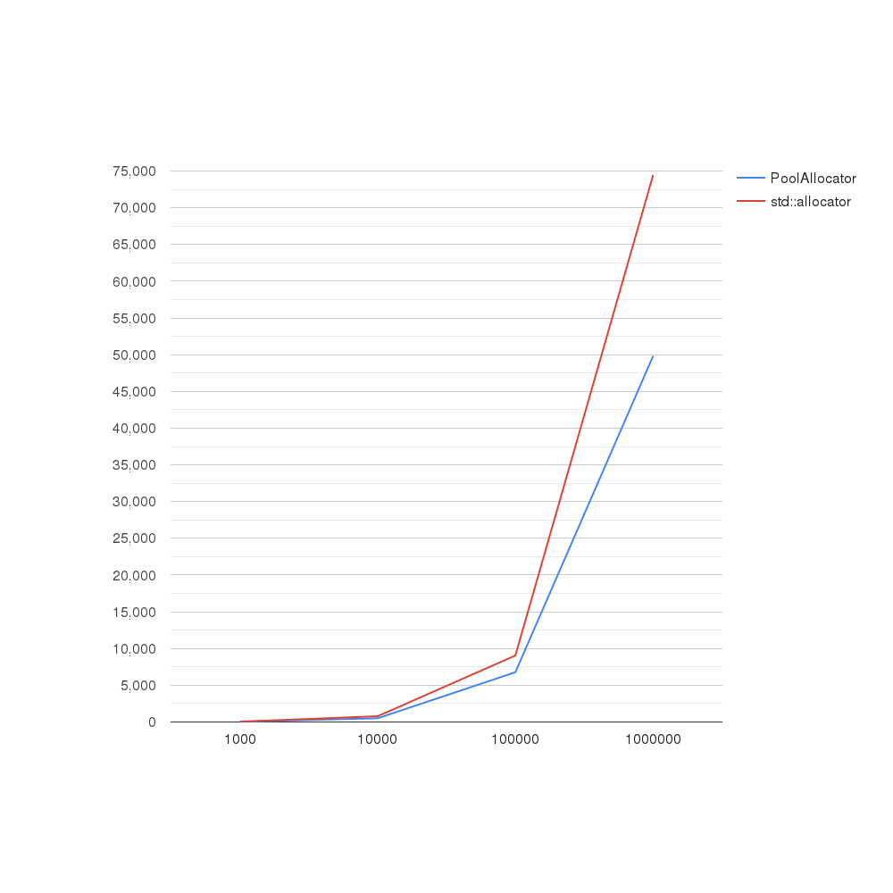
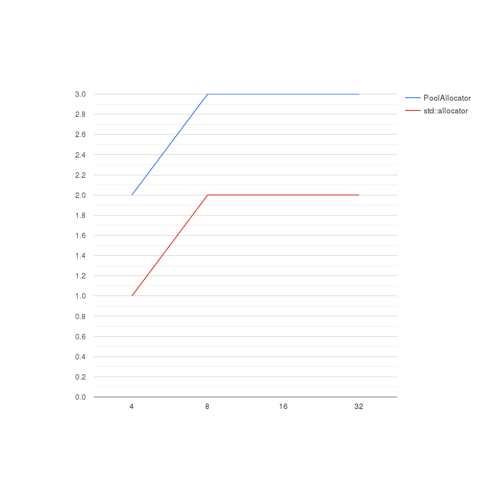

# Pool Allocator #

**Целью** этой работы было изучить устройство работы стандартного аллокатора с++ и, изучив его слабые стороны, написать свой аллокатор, более оптимальный(в каком-то смысле)

**Основная проблемой** std::allocator то, что он не знает для каких целей его используют и поэтому вынужден для каждого вызова allocate выполнять довольно дорогостоющую(в плане времени) операцию обращения в ядро для получения динамической памяти. 

### **Идея** Pool Allocator такова:

Аллокатор заранее параметризируется, сколько ему памяти нужно будет выделить и в каких количествах.
Это позволяет не обращаться каждый раз к ядру для выделения памяти, а сделать это один раз - при инициализации.

Выделяет и очищает память Pool allocator за O(log(n)), где n - количество пулов. Самое долгая операция это инициализация O(n).

Итак, предлагаю ознакомиться с графиками сравнения std::allocator и моего PoolMemoryAllocator:

### std::vector(вместе с инициализацией) ###
В ходе сравнения было вызвано n push_back в пустой контейнер.
В каждом из случаев в PoolMemoryAllocator создавался 1 пулл, разделенный на 2 куска размера минимальное 2^k >= n.
Это является оптимальным, так как при каждом вызове push_back, контейнер если увеличивается, то увеличивается по степени двойки.

### std::vector(без инициализации) ###
В ходе сравнения было вызвано n push_back в пустой контейнер.
В каждом из случаев в PoolMemoryAllocator создавался 1 пулл, разделенный на 2 куска размера минимальное 2^k >= n.
Это является оптимальным, так как при каждом вызове push_back, контейнер если увеличивается, то увеличивается по степени двойки.

### std::list(вместе с инициализацией) ###
В ходе сравнения было вызвано n push_back в пустой контейнер.
В каждом из случаев в PoolMemoryAllocator создавался 1 пулл, разделенный на n кусков размера 1(sizeof(T) байт).
Это является оптимальным, так как при каждом вызове push_back контейнер запрашивает 1(sizeof(T) байт).

### std::list(без инициализации) ###
В ходе сравнения было вызвано n push_back в пустой контейнер.
В каждом из случаев в PoolMemoryAllocator создавался 1 пулл, разделенный на n кусков размера 1(sizeof(T) байт).
Это является оптимальным, так как при каждом вызове push_back контейнер запрашивает 1(sizeof(T) байт).

**Можно заметить**, что pool allocator работает быстрее на больших числах, чем стандартный аллокатор. В некоторых случаях различие составляло почти в 2 раза. Но к сожалению, на небольших числах результаты не столь хороши и std::allocator показывает результаты гораздо лучше:

**Стоит отметить**, что Pool Allocator не гарантирует своей оптимальности при неоптимальном выборе параметров для него. Это все еще в руках разработчиков.

## **Вывод:**

Pool Allocator полезен, если известно на каких данных придется работать и известно, что они будут большие(хотя бы 1000). Так в использовании, например, с std::list он наиболее 
продуктивен, ведь позволяет не обращаться каждый раз к вызову динамической памяти ради 1 элемента. 
